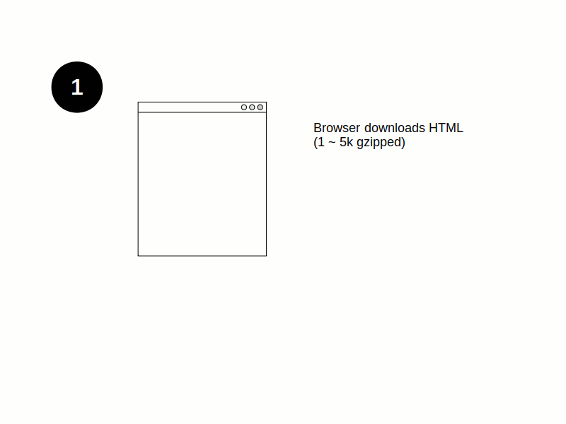
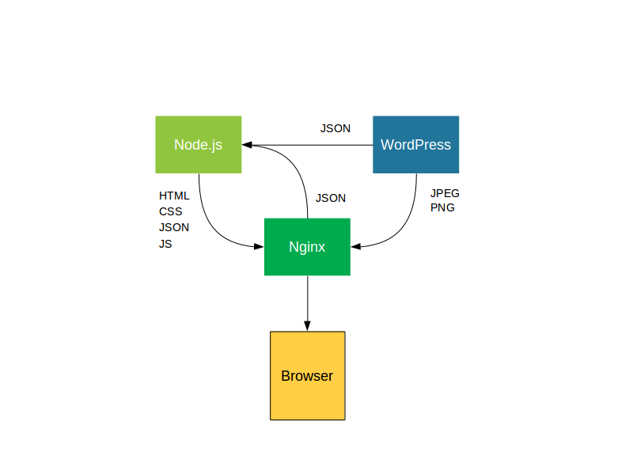
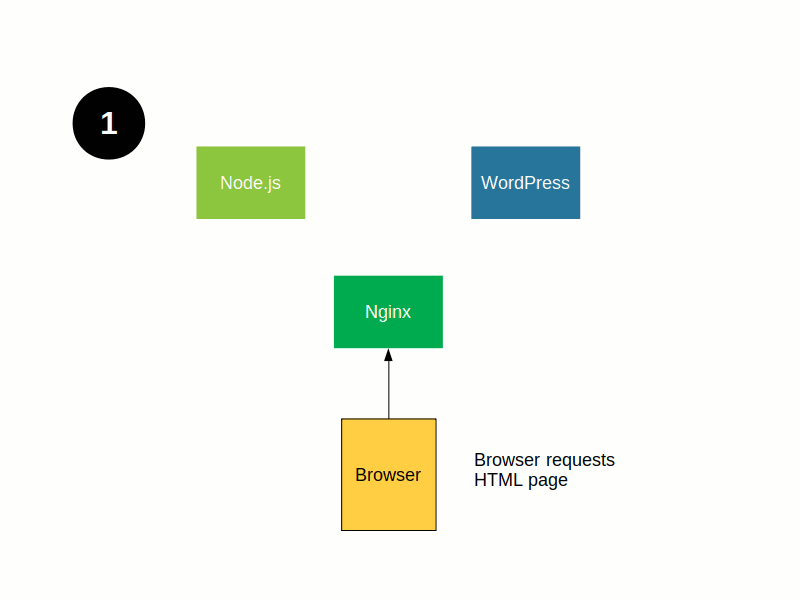
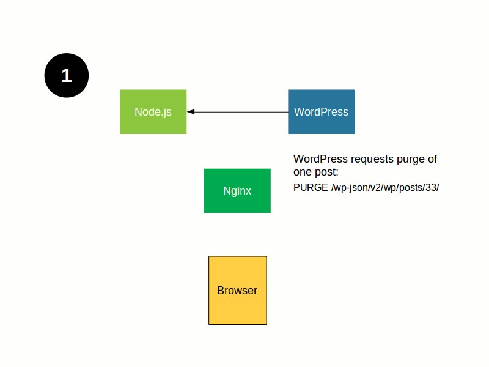
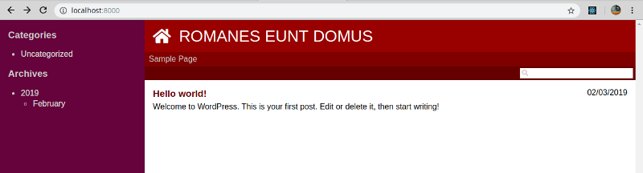
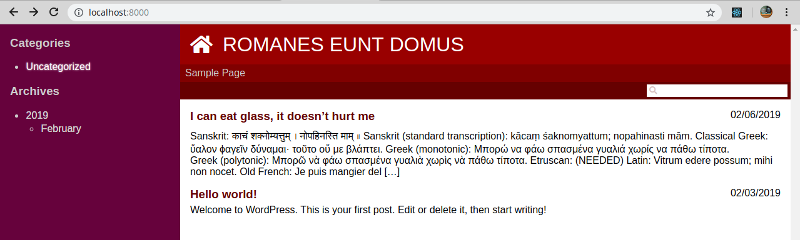
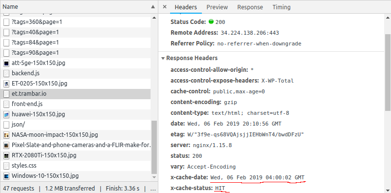
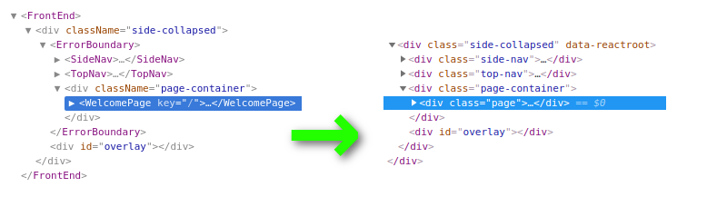

Zero-latency WordPress Front-end
================================
In this example, we're going to build a zero-latency front-end for WordPress. When a visitor clicks on a link, a story will instantly appear. No hourglass. No spinner. No blank page. We'll accomplish this by aggressively prefetching data in our client-side code. At the same time, we're going to employ server-side rendering (SSR) to minimize time to first impression. The page should appear within a fraction of a second after the visitor enters the URL.

Combined with aggressive back-end caching, we'll end up with a web site that feels very fast and is cheap to host.

This is a complex example with many moving parts. It's definitely not for beginners. You should already be familiar with technologies involved: [React](https://reactjs.org/), [Nginx caching](https://www.nginx.com/blog/nginx-caching-guide/), and of course [WordPress](https://wordpress.org/) itself.

## Live demo

For the purpose of demonstrating what the example code can do, I've prepared two web sites:

* [pfj.trambar.io](https://pfj.trambar.io)
* [et.trambar.io](https://et.trambar.io)

Both are hosted on the same AWS [A1 medium instance](https://aws.amazon.com/ec2/instance-types/a1/), powered by a single core of a [Graviton CPU](https://www.phoronix.com/scan.php?page=article&item=ec2-graviton-performance&num=1) and backed by 2G of RAM. In terms of computational capability, we have roughly one fourth that of a phone. Not much. For our system though it's more than enough. Most requests will result in cache hits. Nginx will spend most of its time sending data already in memory. We'll be IO-bound long before we're CPU-bound.

[pfj.trambar.io](https://pfj.trambar.io) obtains its data from a test WordPress instance running on the same server. It's populated with random lorem ipsum text. You can log into the [WordPress admin page](https://pfj.trambar.io/wp-admin/) and post a article using the account `bdickus` (password: `incontinentia`). Publication of a new article will trigger a cache purge. The article should appear in the front page automatically after 30 seconds or so (no need to hit refresh button).

You can see a list of what's in the Nginx cache [here](https://pfj.trambar.io/.cache).

[et.trambar.io](https://et.trambar.io) obtains its data from [ExtremeTech](https://www.extremetech.com/). It's meant to give you a better sense of how the example code fares with real-world contents. The site has close to two decades' worth of articles. Our server does not receive cache purge commands from this WordPress instance so the contents could be out of date. Cache misses will also lead to slightly longer pauses.

## Server-side rendering

Isomorphic React components are capable of rendering on a web server and in a web browser. One primary purpose of server-side rendering (SSR) is search engine optimization. Another is to mask JavaScript loading time. Rather than displaying a spinner or progress bar, we render the front-end on the server and send the HTML to the browser. Effectively, we're using the front-end's own appearance as its loading screen.

The following animation depicts how an SSR-augmented single-page web-site works. Click on it if you wish to view it as separate images.

[](docs/ssr.md)

While the SSR HTML is not backed by JavaScript, it does have functional hyperlinks. If the visitor clicks on a link before the JavaScript bundle is done loading, he'll end up at another SSR page. As the server has immediate access to both code and data, it can generate this page very quickly. It's also possible that the page exists already in the server-side cache, in which case it'll be sent even sooner.

## Back-end services

Our back-end consists of three services: WordPress itself, Nginx, and Node.js. The following diagram shows how contents of various types move between them:



Note how Nginx does not fetch JSON data directly from WordPress. Instead, data goes through Node first. This detour is due mainly to WordPress not attaching [e-tags](https://en.wikipedia.org/wiki/HTTP_ETag) to JSON responses. Without e-tags the browser cannot perform cache validation (i.e. conditional request ￫ 304 not modified). Passing the data through Node also gives us a chance to strip out unnecessary fields. Finally, it lets us compress the data prior to sending it to Nginx. Size reduction means more contents will fit in the cache. It also saves Nginx from having to gzip the same data over and over again.

Node will request JSON data from Nginx when it runs the front-end code. If the data isn't found in the cache, Node will end up serving its own request. This round-trip will result in Nginx caching the JSON data. We want that to happen since the browser will soon be requesting the same data (since it'll be running the same front-end code).

## Uncached page access

The following animation shows what happens when the browser requests a page and Nginx's cache is empty. Click on it to view it as separate images.

[](docs/uncached.md)

## Cached page access

The following animation shows how page requests are handled once contents (both HTML and JSON) are cached. This is what happens most of the time.

[](docs/cached.md)

## Cache purging

The following animation depicts what happens when a new article is published on WordPress.

[](docs/purge.md)

## Getting started

This example is delivered as a Docker app. Please install Docker and Docker Compose if they aren't already installed on your computer. On Windows and OSX, you might need to enable port forwarding for port 8000.

In a command-line prompt, run `npm install` or `npm ci`. Once all libraries have been downloaded, run `npm run start-server`. Docker will proceed to download four official images from Docker Hub: [WordPress](https://hub.docker.com/_/wordpress/), [MariaDB](https://hub.docker.com/_/mariadb), [Nginx](https://hub.docker.com/_/nginx), and [Node.js](https://hub.docker.com/_/node/).

Once the services are up and running, go to `http://localhost:8000/wp-admin/`. You should be greeted by WordPress's installation page. Enter some information about your test site and create the admin account. Log in and go to **Settings** > **Permalinks**. Choose one of the URL schemas.

Next, go to **Plugins** > **Add New**. Search for `Proxy Cache Purge`. Install and activate the plugin. A new **Proxy Cache** item will appear in the side navigation bar. Click on it. At the bottom of the page, set the **Custom IP** to 172.129.0.3. This is the address of our Node.js service.

In a different browser tab, go to `http://localhost:8000/`. You should see the front page with just a sample post:



Now return to the WordPress admin page and publish another test post. After 30 seconds or so, the post should automatically appear in the front page:



To see the code running in debug mode, run `npm run watch`. The client-side code will be rebuilt whenever changes occurs.

To populate your test site with dummy data, install the [FakerPress plugin](https://wordpress.org/plugins/fakerpress/).

To shut down the test server, run `npm run stop-server`. To remove Docker volumes used by the example, run `npm run remove-server`.

If you have a production web site running WordPress, you can see how its contents look in the example front-end (provided that the REST interface is exposed and permalinks are enabled). Open `docker-compose-remote.yml` and change the environment variable `WORDPRESS_HOST` to the address of the site. Then run `npm run start-server-remote`.

## Nginx configuration

Let us look at the [Nginx configuration file](https://github.com/trambarhq/relaks-wordpress-example/blob/master/server/nginx/default.conf). The first two lines tell Nginx where to place cached responses, how large the cache should be (1 GB), and for how long to keep inactive entries (7 days):

```
proxy_cache_path /var/cache/nginx/data keys_zone=data:10m max_size=1g inactive=7d;
proxy_temp_path /var/cache/nginx/tmp;
```

[`proxy_cache_path`](http://nginx.org/en/docs/http/ngx_http_proxy_module.html#proxy_cache_path) is specified without `levels` so that files are stored in a flat directory structure. This makes it easier to scan the cache. [`proxy_temp_path`](http://nginx.org/en/docs/http/ngx_http_proxy_module.html#proxy_temp_path) points to a location on the same volume as the cache so Nginx can move files into it with a rename operation.

The following section configures reverse-proxying for the WordPress admin page:

```
location ~ ^/wp-* {
    proxy_pass http://wordpress;
    proxy_set_header Host $http_host;
    proxy_set_header X-Real-IP $remote_addr;
    proxy_set_header X-Forwarded-For $remote_addr;
    proxy_set_header X-Forwarded-Host $server_name;
    proxy_set_header X-Forwarded-Proto $scheme;
    proxy_pass_header Set-Cookie;
    proxy_redirect off;
}
```

The following section controls Nginx's interaction with Node:

```
location / {
    proxy_pass http://node;
    proxy_set_header Host $http_host;
    proxy_cache data;
    proxy_cache_key $uri$is_args$args;
    proxy_cache_min_uses 1;
    proxy_cache_valid 400 404 1m;
    proxy_ignore_headers Vary;

    add_header Access-Control-Allow-Origin *;
    add_header Access-Control-Expose-Headers X-WP-Total;
    add_header X-Cache-Date $upstream_http_date;
    add_header X-Cache-Status $upstream_cache_status;
}
```

We select the cache zone we defined earlier with the [`proxy_cache`](http://nginx.org/en/docs/http/ngx_http_proxy_module.html#proxy_cache) directive. We set the cache key using [`proxy_cache_key`](http://nginx.org/en/docs/http/ngx_http_proxy_module.html#proxy_cache_key). The MD5 hash of the path plus the query string will be the name used to save each cached server response. With the [`proxy_cache_min_uses`](http://nginx.org/en/docs/http/ngx_http_proxy_module.html#proxy_cache_min_uses) directive we tell Nginx to start caching on the very first request. With the [`proxy_cache_valid`](http://nginx.org/en/docs/http/ngx_http_proxy_module.html#proxy_cache_valid) directive we ask Nginx to cache error responses for one minute.

The [`proxy_ignore_headers`](http://nginx.org/en/docs/http/ngx_http_proxy_module.html#proxy_ignore_headers) directive is there to keep Nginx from creating separate cache entries when requests to the same URL have different `Accept-Encoding` headers (additional compression methods, for example).

The first two headers added using [add_header](http://nginx.org/en/docs/http/ngx_http_headers_module.html#add_header) are there to enable [CORS](https://developer.mozilla.org/en-US/docs/Web/HTTP/CORS). The last two `X-Cache-*` headers are for debugging purpose. They let us figure out whether a request has resulted in a cache hit when we examine it using the browser's development tools:



## HTML page generation

The following Express handler ([index.js](https://github.com/trambarhq/relaks-wordpress-example/blob/master/server/index.js#L100)) is invoked when Nginx asks for an HTML page. This should happen infrequently as page navigation is handled client-side. Most visitors will enter the site through the root page and that's inevitably cached.

The handler detects whether the remote agent is a search-engine spider and handle the request accordingly.

```javascript
async function handlePageRequest(req, res, next) {
    try {
        const path = req.url;
        const noJS = (req.query.js === '0');
        const target = (req.isSpider() || noJS) ? 'seo' : 'hydrate';
        const page = await PageRenderer.generate(path, target);
        if (target === 'seo') {
            // not caching content generated for SEO
            res.set({ 'X-Accel-Expires': 0 });
        } else {
            res.set({ 'Cache-Control': CACHE_CONTROL });

            // remember the URLs used by the page
            pageDependencies[path] = page.sourceURLs;
        }
        res.type('html').send(page.html);
    } catch (err) {
        next(err);
    }
}
```

`PageRenderer.generate()` ([page-renderer.js](https://github.com/trambarhq/relaks-wordpress-example/blob/master/server/page-renderer.js#L13)) uses our isomorphic React code to generate the page. Since the fetch API doesn't exist on Node.js, we need to supply a compatible function to the data source. We use this opportunity to capture the list of URLs that the front-end accesses. Later, we'll use this list to determine whether a cached page has become out-of-date.

```javascript
async function generate(path, target) {
    console.log(`Regenerating page: ${path}`);
    // retrieve cached JSON through Nginx
    const host = NGINX_HOST;
    // create a fetch() that remembers the URLs used
    const sourceURLs = [];
    const agent = new HTTP.Agent({ keepAlive: true });
    const fetch = (url, options) => {
        if (url.startsWith(host)) {
            sourceURLs.push(url.substr(host.length));
            options = addHostHeader(options);
            options.agent = agent;
        }
        return CrossFetch(url, options);
    };
    const options = { host, path, target, fetch };
    const frontEndHTML = await FrontEnd.render(options);
    const htmlTemplate = await FS.readFileAsync(HTML_TEMPLATE, 'utf-8');
    let html = htmlTemplate.replace(`<!--REACT-->`, frontEndHTML);
    if (target === 'hydrate') {
        // add <noscript> tag to redirect to SEO version
        const meta = `<meta http-equiv=refresh content="0; url=?js=0">`;
        html += `<noscript>${meta}</noscript>`;
    }
    return { path, target, sourceURLs, html };
}
```

`FrontEnd.render()` is a function exported by our front-end code ([ssr.js](https://github.com/trambarhq/relaks-wordpress-example/blob/master/src/ssr.js#L11)):

```javascript
async function render(options) {
    const dataSource = new WordpressDataSource({
        baseURL: options.host + basePath + 'json',
        fetchFunc: options.fetch,
    });
    dataSource.activate();

    const routeManager = new RouteManager({
        routes,
        basePath,
    });
    routeManager.addEventListener('beforechange', (evt) => {
        const route = new Route(routeManager, dataSource);
        evt.postponeDefault(route.setParameters(evt, false));
    });
    routeManager.activate();
    await routeManager.start(options.path);

    const ssrElement = createElement(FrontEnd, { dataSource, routeManager, ssr: options.target });
    const rootNode = await harvest(ssrElement);
    const html = renderToString(rootNode);
    return html;
}
```

The function initiates the data source and the route manager. Using these as props, it creates the root React element `<FrontEnd />`. The function `harvest()` (from [relaks-harvest](https://github.com/trambarhq/relaks-harvest)) then recursively renders the component tree until all we have are plain HTML elements:



The tree is then converted to a text string using React DOM Server's [renderToString()](https://reactjs.org/docs/react-dom-server.html#rendertostring).

Our front-end is built with the help of [Relaks](https://github.com/trambarhq/relaks), a library that let us make asynchronous calls within a React component's render function. Data retrievals are done as part of the rendering cycle. This model makes SSR very straight forward. To render a page, we just call the render functions of all its components and wait for them to finish.

### JSON data retrieval

The following handler is invoked when Nginx requests a JSON file (i.e. when a cache miss occurs). It's quite simple. All it does is change the URL prefix from `/json/` to `/wp-json/` and set a couple HTTP headers:

```javascript
async function handleJSONRequest(req, res, next) {
    try {
        // exclude asterisk
        const root = req.route.path.substr(0, req.route.path.length - 1);
        const path = `/wp-json/${req.url.substr(root.length)}`;
        const json = await JSONRetriever.fetch(path);
        if (json.total) {
            res.set({ 'X-WP-Total': json.total });
        }
        res.set({ 'Cache-Control': CACHE_CONTROL });
        res.send(json.text);
    } catch (err) {
        next(err);
    }
}
```

`JSONRetriever.fetch()` ([json-retriever.js](https://github.com/trambarhq/relaks-wordpress-example/blob/master/server/json-retriever.js#L8)) downloads JSON data from WordPress:

```javascript
async function fetch(path) {
    console.log(`Retrieving data: ${path}`);
    const url = `${WORDPRESS_HOST}${path}`;
    const res = await CrossFetch(url, { agent });
    let resText = await res.text();
    let object;
    try {
        object = JSON.parse(resText);
    } catch (err) {
        // remove any error msg that got dumped into the output stream
        if (res.status === 200) {
            resText = resText.replace(/^[^\{\[]+/, '');
            object = JSON.parse(resText);
        }
    }
    if (res.status >= 400) {
        const msg = (object && object.message) ? object.message : resText;
        const err = new Error(msg);
        err.status = res.status;
        throw err;
    }
    const total = parseInt(res.headers.get('X-WP-Total'));
    removeSuperfluousProps(path, object);
    const text = JSON.stringify(object);
    return { path, text, total };
}
```

Fields that aren't needed are stripped out before the JSON object is stringified again.

Certain rogue WP plugins dump HTML comments into the output stream even when the output is JSON. We need to filter them out whenever `JSON.parse()` throws an error.

## Purge request Handling

The [Proxy Cache Purge](https://wordpress.org/plugins/varnish-http-purge/) sends out `PURGE` requests whenever a new article is published on WordPress. We configured our system so that Node would receive these requests. Before we carry out the purge, we check if the request really is from WordPress. It may give us either an URL or a wildcard expression. We watch for two specific scenarios: when the plugin wants to purge the whole cache and when it wants to purge a single JSON object. In the latter case, we proceed to purge all queries that might be affected.

```javascript
async function handlePurgeRequest(req, res) {
    // verify that require is coming from WordPress
    const remoteIP = req.connection.remoteAddress;
    res.end();
    const wordpressIP = await dnsCache.lookupAsync(WORDPRESS_HOST.replace(/^https?:\/\//, ''));
    if (remoteIP !== `::ffff:${wordpressIP}`) {
        return;
    }

    const url = req.url;
    const method = req.headers['x-purge-method'];
    if (method === 'regex' && url === '/.*') {
        pageDependencies = {};
        await NginxCache.purge(/.*/);
        await PageRenderer.prefetch('/');
    } else if (method === 'default') {
        // look for URLs that looks like /wp-json/wp/v2/pages/4/
        const m = /^\/wp\-json\/(\w+\/\w+\/\w+)\/(\d+)\/$/.exec(url);
        if (!m) {
            return;
        }

        // purge matching JSON files
        const folderPath = m[1];
        const pattern = new RegExp(`^/json/${folderPath}.*`);
        await NginxCache.purge(pattern);

        // purge the timestamp so CSR code knows something has changed
        await NginxCache.purge('/.mtime');

        // look for pages that made use of the purged JSONs
        for (let [ path, sourceURLs ] of Object.entries(pageDependencies)) {
            const affected = sourceURLs.some((sourceURL) => {
                return pattern.test(sourceURL);
            });
            if (affected) {
                // purge the cached page
                await NginxCache.purge(path);
                delete pageDependencies[path];

                if (path === '/') {
                    await PageRenderer.prefetch('/');
                }
            }
        }
    }
}
```

For example, when we receive `PURGE /wp-json/wp/v2/posts/100/`, we perform a purge of `/json/wp/v2/posts.*`. The approach is pretty conservative. Entries will often get purged when there's no need. This isn't terrible since the data can be reloaded fairly quickly. Since e-tags are based on contents, when no change has actually occurred we would end up with the same e-tag. Nginx will still send `304 not modified` to the browser despite a back-end cache miss.

After purging JSON data, we purge the `/.mtime` timestamp file. This act as a signal to the browser that it's time to rerun data queries.

Then we purge HTML files generated earlier that made use of the purged data. Recall how in `handlePageRequest()` we had saved the list of source URLs.

Only Nginx Plus (i.e. paid version of Nginx) supports cache purging. `NginxCache.purge()` ([nginx-cache.js](https://github.com/trambarhq/relaks-wordpress-example/blob/master/server/nginx-cache.js#L7)) is basically a workaround for that fact. The code is not terribly efficient but does the job. Hopefully cache purging will be available in the free version of Nginx in the future.

## Timestamp handling

The handle for timestamp requests is extremely simple:

```javascript
async function handleTimestampRequest(req, res, next) {
    try {
        const now = new Date;
        const ts = now.toISOString();
        res.set({ 'Cache-Control': CACHE_CONTROL });
        res.type('text').send(ts);
    } catch (err) {
        next(err);
    }
}
```

## DOM hydration

The following function ([main.js](https://github.com/trambarhq/relaks-wordpress-example/blob/master/src/main.js#L13)) is responsible for bootstrapping the front-end:

```javascript
async function initialize(evt) {
    // create data source
    const host = process.env.DATA_HOST || `${location.protocol}//${location.host}`;
    const basePath = process.env.BASE_PATH;
    const dataSource = new WordpressDataSource({
        baseURL: host + basePath + 'json',
    });
    dataSource.activate();

    // create route manager
    const routeManager = new RouteManager({
        routes,
        basePath,
        useHashFallback: (location.protocol !== 'http:' && location.protocol !== 'https:'),
    });
    routeManager.addEventListener('beforechange', (evt) => {
        const route = new Route(routeManager, dataSource);
        evt.postponeDefault(route.setParameters(evt, true));
    });
    routeManager.activate();
    await routeManager.start();

    const container = document.getElementById('react-container');
    if (!process.env.DATA_HOST) {
        // there is SSR support when we're fetching data from the same host
        // as the HTML page
        const ssrElement = createElement(FrontEnd, { dataSource, routeManager, ssr: 'hydrate' });
        const seeds = await harvest(ssrElement, { seeds: true });
        plant(seeds);
        hydrate(ssrElement, container);
    }
    const csrElement = createElement(FrontEnd, { dataSource, routeManager });
    render(csrElement, container);

    // check for changes periodically
    const mtimeURL = host + basePath + '.mtime';
    let mtimeLast;
    for (;;) {
        try {
            const res = await fetch(mtimeURL);
            const mtime = await res.text();
            if (mtime !== mtimeLast) {
                if (mtimeLast) {
                    dataSource.invalidate();
                }
                mtimeLast = mtime;
            }
        } catch (err) {
        }
        await delay(30 * 1000);
    }
}
```

When SSR is employed, we ["hydrate"](https://reactjs.org/docs/react-dom.html#hydrate) DOM elements that are already in the page. We first perform the same sequence of actions that was done on the server. Doing so pulls in data that will be needed for CSR later (while the visitor is still looking at the SSR HTML). Passing `{ seeds: true }` to `harvest()` tells it to return the contents of asynchronous Relaks components in a list. These "seeds" are then planted into Relaks, so that asynchronous components can return their initial appearances synchronously. Without this step, the small delays required by asynchronous rendering would lead to mismatches during the hydration process.

Once the DOM is hydrated, we complete the transition to CSR by rendering a second `<FrontEnd />` element, this time without the prop `ssr`.

Then we enter an endless loop that polls the server for content update every 30 seconds. Most of the time, the request will end in 304 Not Modified. The timestamp will change when we purge it from the Nginx cache.

## Routing

We want our front-end to handle WordPress permalinks correctly. This makes page routing somewhat tricky since we cannot rely on simple pattern matching. The URL `/hello-world/` could potentially point to either a page, a post, or a list of posts with a given tag. It all depends on slug assignment. We always need information from the server in order to find the right route.

[`relaks-route-manager`](https://github.com/trambarhq/relaks-route-manager) was not designed with this usage scenario in mind. It does provide a mean, however, to perform asynchronous operations prior to a route change. When it emits a `beforechange` event, we can call `evt.postponeDefault()` to defer the default action (permitting the change) until a promise fulfills:

```javascript
    routeManager.addEventListener('beforechange', (evt) => {
        const route = new Route(routeManager, dataSource);
        evt.postponeDefault(route.setParameters(evt, true));
    });
```

`route.setParameters()` ([routing.js](https://github.com/trambarhq/relaks-wordpress-example/blob/master/src/routing.js#L62)) basically displaces the default parameter extraction mechanism. Our routing table is reduced to the following:

```javascript
const routes = {
    'page': { path: '*' },
};
```

Which simply matches any URL.

`route.setParameters()` itself calls `route.getParameters()` to obtain the parameters:

```javascript
    async setParameters(evt, fallbackToRoot) {
        const params = await this.getParameters(evt.path, evt.query);
        if (params) {
            params.module = require(`pages/${params.pageType}-page`);
            _.assign(evt.params, params);
        } else {
            if (fallbackToRoot) {
                await this.routeManager.change('/');
                return false;
            } else {
                throw new RelaksRouteManagerError(404, 'Route not found');
            }
        }
    }
```

The key parameter is `pageType`, which is used to load one of the [page components](https://github.com/trambarhq/relaks-wordpress-example/tree/master/src/pages).

At a glance `route.getParameters()` ([routing.js](https://github.com/trambarhq/relaks-wordpress-example/blob/master/src/routing.js#L77)) might seem incredibly inefficient. To see if a URL points to a page, it fetches all pages and see if one of them has that URL:

```javascript
    const allPages = await wp.fetchPages();
    const page = _.find(allPages, matchLink);
    if (page) {
        return { pageType: 'page', pageSlug: page.slug, siteURL };
    }
```

It does the same check on categories:

```javascript
    const allCategories = await wp.fetchCategories();
    const category = _.find(allCategories, matchLink);
    if (category) {
        return { pageType: 'category', categorySlug: category.slug, siteURL };
    }
```

Most of the time, the data in question would be cached already. The top nav loads the pages, while the side nav loads the categories (and also top tags). Resolving the route wouldn't require actual data transfer. On cold start the process would be somewhat slow. Our SSR mechanism would mask this delay, however. A visitor wouldn't notice it. Of course, since we have all pages at hand, a page will pop up instantly when the visitor clicks on the nav bar.

`route.getObjectURL()` ([routing.js](https://github.com/trambarhq/relaks-wordpress-example/blob/master/src/routing.js#L32)) is used to obtain the URL to an object (post, page, category, etc.). The method just remove the site URL from the object's WP permalink:

```javascript
    getObjectURL(object) {
        const { siteURL } = this.params;
        const link = object.link;
        if (!_.startsWith(link, siteURL)) {
            throw new Error(`Object URL does not match site URL`);
        }
        const path = link.substr(siteURL.length);
        return this.composeURL({ path });
    }
```

In order to link to a post, we must download the post beforehand. Clicking on an article will nearly always bring it up instantly.

For links to categories and tags, we perform explicit prefetching:

```javascript
    prefetchObjectURL(object) {
        const url = this.getObjectURL(object);
        setTimeout(() => { this.loadPageData(url) }, 50);
        return url;
    }
```

The first ten posts are always fetched so the visitor will see something immediately upon clicking.

## WelcomePage

`WelcomePage` ([welcome-page.jsx](https://github.com/trambarhq/relaks-wordpress-example/blob/master/src/pages/welcome-page.jsx)) is an asynchronous component. The function is declared async and it uses the `useProgress` hook from Relaks.

```javascript
import React from 'react';
import Relaks, { useProgress } from 'relaks';

import { PostList } from 'widgets/post-list';

async function WelcomePage(props) {
    const { wp, route } = props;
    const [ show ] = useProgress();

    render();
    const posts = await wp.fetchPosts();
    render();
    const medias = await wp.fetchFeaturedMedias(posts, 10);
    render();

    function render() {
        show(
            <div className="page">
                <PostList route={route} posts={posts} medias={medias} minimum={40} />
            </div>
        );
    }
}

const component = Relaks.memo(WelcomePage);

export {
    component as default,
};
```

The logic is fairly simple. We first render without data. Then we request a list of posts from the server. When it arrives, we render again. We ask for images associated with the first 10 posts and render once more once we have them.

## PostList

`PostList` ([post-list.jsx](https://github.com/trambarhq/relaks-wordpress-example/blob/master/src/widgets/post-list.jsx)) is a regular React functional component. It renders a list of posts:

```javascript
import _ from 'lodash';
import Moment from 'moment';
import React, { useEffect } from 'react';

import { PostListView } from 'widgets/post-list-view';

function PostList(props) {
    const { route, posts, medias, minimum, maximum } = props;

    useEffect(() => {
        if (posts && posts.more) {
            const loadMore = (fraction) => {
                if (posts.length < minimum) {
                    posts.more();
                } else if (posts.length < maximum) {
                    const { scrollTop, scrollHeight } = document.body.parentNode;
                    if (scrollTop > scrollHeight * fraction) {
                        posts.more();
                    }
                }
            };
            const handleScroll = (evt) => {
                loadMore(0.5);
            };
            loadMore(0.75);
            document.addEventListener('scroll', handleScroll);
            return () => {
                document.removeEventListener('scroll', handleScroll);
            };
        }
    }, [ posts ]);

    if (!posts) {
        return null;
    }
    return (
        <div className="posts">
            {posts.map(renderPost)}
        </div>
    );

    function renderPost(post, i) {
        let media = _.find(medias, { id: post.featured_media });
        return <PostListView route={route} post={post} media={media} key={post.id} />
    }
}

PostList.defaultProps = {
    minimum: 20,
    maximum: 500,
};

export {
    PostList,
};
```

The component is responsible for loading more posts when the user scrolls down (past the half-way point). It'll also do so when the number of posts does not meet the minimum specified.

## PostListView

`PostListView` ([post-list-view.jsx](https://github.com/trambarhq/relaks-wordpress-example/blob/master/src/widgets/post-list-view.jsx)) is a simple component that renders a link to a post along with a short excerpt:

```javascript
import _ from 'lodash';
import Moment from 'moment';
import React from 'react';

import { HTML } from 'widgets/html';
import { MediaView } from 'widgets/media-view';

function PostListView(props) {
    const { route, post, media } = props;
    const title = _.get(post, 'title.rendered', '');
    const excerptRendered = _.get(post, 'excerpt.rendered', '');
    const excerpt = cleanExcerpt(excerptRendered);
    const url = route.prefetchObjectURL(post);
    const published = _.get(post, 'date_gmt');
    const date = (published) ? Moment(published).format('L') : '';

    if (media) {
        return (
            <div className="post-list-view with-media">
                <div className="media">
                    <MediaView media={media} />
                </div>
                <div className="text">
                    <div className="headline">
                        <h3 className="title">
                            <a href={url}><HTML text={title} /></a>
                        </h3>
                        <div className="date">{date}</div>
                    </div>
                    <div className="excerpt">
                        <HTML text={excerpt} />
                    </div>
                </div>
            </div>
        );
    } else {
        return (
            <div className="post-list-view">
                <div className="headline">
                    <h3 className="title">
                        <a href={url}><HTML text={title} /></a>
                    </h3>
                    <div className="date">{date}</div>
                </div>
                <div className="excerpt">
                    <HTML text={excerpt} />
                </div>
            </div>
        );
    }

    function cleanExcerpt(excerpt) {
        const index = excerpt.indexOf('<p class="link-more">');
        if (index !== -1) {
            excerpt = excerpt.substr(0, index);
        }
        return excerpt;
    }
}

export {
    PostListView,
};
```

## PostPage

`PostPage` ([post-post.jsx](https://github.com/trambarhq/relaks-wordpress-example/blob/master/src/pages/post-page.jsx)) is an asynchronous component responsible for rendering a WP post:

```javascript
import _ from 'lodash';
import Moment from 'moment';
import React from 'react';
import Relaks, { useProgress } from 'relaks';

import { Breadcrumb } from 'widgets/breadcrumb';
import { PostView } from 'widgets/post-view';
import { TagList } from 'widgets/tag-list';
import { CommentSection } from 'widgets/comment-section';

async function PostPage(props) {
    const { wp, route } = props;
    const { postSlug } = route.params;
    const [ show ] = useProgress();

    render();
    const post = await wp.fetchPost(postSlug);
    render();
    const categories = await findCategoryChain(post);
    render();
    const author = await wp.fetchAuthor(post);
    render();
    const tags = await wp.fetchTagsOfPost(post);
    render()
    let comments;
    if (!wp.ssr) {
        comments = await wp.fetchComments(post);
        render();
    }

    function render() {
        const trail = [ { label: 'Categories' } ];
        if (categories) {
            for (let category of categories) {
                const label = _.get(category, 'name', '');
                const url = route.prefetchObjectURL(category);
                trail.push({ label, url });
            }
        }
        show(
            <div className="page">
                <Breadcrumb trail={trail} />
                <PostView post={post} author={author} transform={route.transformNode} />
                <TagList route={route} tags={tags} />
                <CommentSection comments={comments} />
            </div>
        );
    }

    async function findCategoryChain(post) {
        if (!post) return [];
        const allCategories = await wp.fetchCategories();

        // add categories, including their parents as well
        const applicable = [];
        const include = (id) => {
            const category = _.find(allCategories, { id })
            if (category) {
                if (!_.includes(applicable, category)) {
                    applicable.push(category);
                }
                // add parent category as well
                include(category.parent);
            }
        };
        for (let id of post.categories) {
            include(id);
        }

        // see how recently a category was visited
        const historyIndex = (category) => {
            const predicate = { params: { categorySlug: category.slug }};
            return _.findLastIndex(route.history, predicate);
        };
        // see how deep a category is
        const depth = (category) => {
            if (category.parent) {
                const predicate = { id: category.parent };
                const parent = _.find(allCategories, predicate);
                if (parent) {
                    return depth(parent) + 1;
                }
            }
            return 0;
        };

        // order applicable categories based on how recently it was visited,
        // how deep it is, and alphabetically; the first criteria makes our
        // breadcrumb works more sensibly
        const ordered = _.orderBy(applicable, [ historyIndex, depth, 'name' ], [ 'desc', 'desc', 'asc' ]);
        const anchorCategory = _.first(ordered);

        const trail = [];
        if (anchorCategory) {
            // add category and its ancestors
            for (let c = anchorCategory; c; c = _.find(applicable, { id: c.parent })) {
                trail.unshift(c);
            }
            // add applicable child categories
            for (let c = anchorCategory; c; c = _.find(applicable, { parent: c.id })) {
                if (c !== anchorCategory) {
                    trail.push(c);
                }
            }
        }
        return trail;
    }
}

const component = Relaks.memo(PostPage);

export {
    component as default,
};
```

Basically, we fetch the post, categories, author, tags, and comments, rerendering each time we got something. Comments are omitted when we're rendering server-side to reduce the frequency of cache purges. There's no real need for them to appear immediately.

The code for obtaining the category list is somewhat complicated because posts can fall into multiple categories. To meet user expectation we want our breadcrumb to display the category that's most recently visited. That's determined looking at the route history.

## Other pages

The [other pages](https://github.com/trambarhq/relaks-wordpress-example/tree/master/src/pages) all follow the same basic pattern: render, fetch data, render.

## Cordova deployment

This is a bonus section. It shows how you can create a cheapskate mobile app with the help of [Cordova](https://cordova.apache.org/). To get started, first install [Android Studio](https://developer.android.com/studio/install) or [Xcode](https://developer.apple.com/xcode/). Then run `npm install -g cordova-cli` in the command line. Afterward, go to `relaks-wordpress-example/cordova/sample-app` and run `cordova prepare android` or `cordova prepare ios`. Open the newly created project in Android Studio or Xcode. You'll find it in `relaks-wordpress-example/cordova/sample-app/platforms/[android|ios]`. If nothing has gone amiss, you should be able to deploy the example to an attached phone. Cordova is a notoriously brittle platform, however. Your mileage may vary.

The Cordova code in the repo retrieves data from `https://et.trambar.io`. To change the location, set the environment variable `CORDOVA_DATA_HOST` to the desired address and run `npm run build`.

## Final words

I hope this example lend you some new inspirations. While WordPress is old software, with a bit of clever coding we can greatly enhance the end-user experience. Our demo system feels fast on initial load. It feels fast during subsequent navigation. More importantly perhaps, the system is cheap to operate.

The concept demonstrated here aren't specific to WordPress. Server-side rendering (SSR) is a very useful technique for any single-page web app. It lets us festoon our project with JavaScript libraries without having to worry too much about the negative impact on load time. Our example front-end takes up a whopping 766KB (222KB gzipped). Yet thanks to SSR, the file size has no discernible impact.
